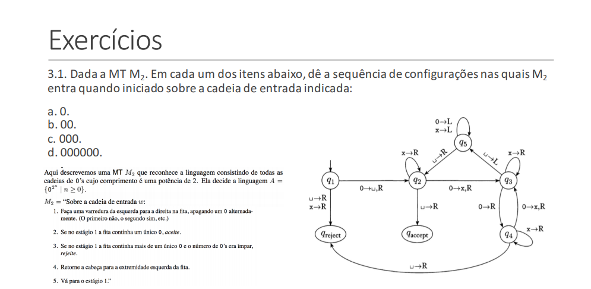

# Turing-Machine
## A Turing Machine that recognizes strings of zeros wich size is a power of 2

* O objetivo desse algoritmo é a implementação de uma MT que reconhece a linguagem consistindo de todas as cadeias de 0's cujo comprimento é uma potência de 2.

* Para tal, a metodologia utilizada foi a criação de funções que representam os estados da MT, uma lista representando a fita magnética com os valores de entrada, e a cabeça de leitura que é representada pela execução da movimentação de indices da lista.
